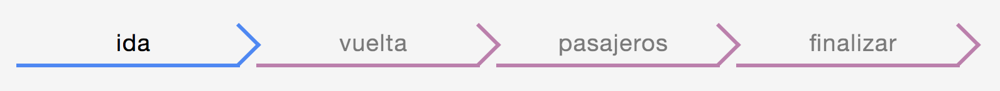
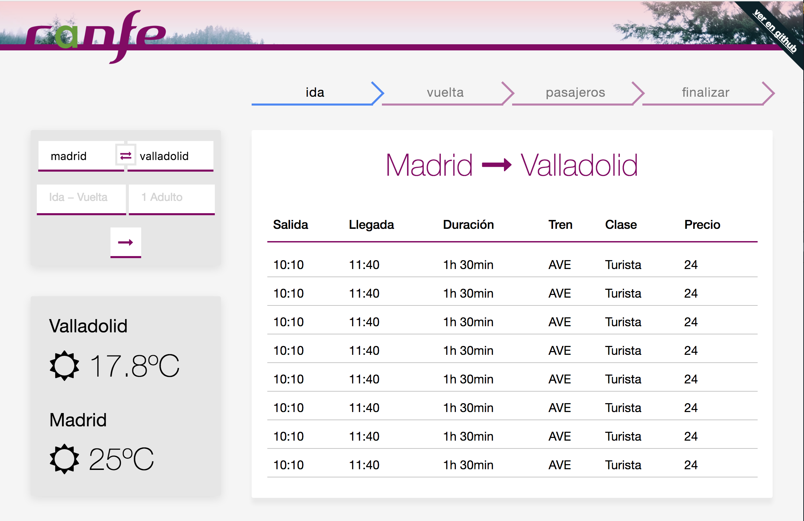

# Usabilidad y Accesibilidad Web

En primer lugar es importante diferenciar entre Usabilidad y Accesibilidad, a grandes rasgos, podemos definir la Usabilidad como la experiencia de usuario, es decir, como un interlocutor humano va a usar nuestra web y percibir nuestro mensaje. Mientras que la accesibilidad estaría destinado a un caracter más tecnico que permita a cierto segmento con discapacidades poder usar nuestra web.

## Usabilidad

Tambien llamada "UX (User Experience)" o en español "Experiencia de Usuario", tiene que ver con el diseño de una web que facilita a un humano su utilización y la finalización de una tarea.

Es diseño, cuando este lo entendemos como no solo caracteristicas esteticas.

Para un buen diseño es importante definir primero nuestro proyecto, el cual es la web de Renfe y un objetivo: la compra de billetes.

Entendemos que el diseño se tiene que centrar alrededor de proceso de compra, ya que predecimos que será el caso de uso más común y posteriormente optimizar para los sucesivos casos de uso populares, como puede ser: Cancelar/cambiar un billete, buscar ofertas y ayuda.


### Página Principal

Nuestra intencion es buscar la practidad y la familiaridad para que el proceso de compra tenga la menor fricción posible.
Además queremos aprovechar esta posición privilegiada para comunicar una imagen de marca moderna, fiable, segura, ecologicá y española.

### Consistencia y estandarización:

Los usuarios de las páginas web tienden a hacer un uso mecánico de esta, por esta razón se debe seguir unas pautas durante todo el desarrollo del sitio web.

+ Etiquetado de los botones: Utilizamos siempre los mismos términos en aquellos botones que realicen la misma acción. No usar sinónimos como Eliminar o Borrar, utilizar siempre el mismo durante el desarrollo de nuestra página.

+ Orden de los menús: Seguir siempre el mismo orden, si damos las funciones “Crear”, “Modificar”, “Eliminar”, seguir ofreciéndolas en ese orden, no poner en el siguiente submenú “Crear”, “Eliminar”, “Modificar” para facilitar un uso más mecánico y fluido de la web.

+ Estilo y posición de los botones: Los botones se posicionen en lugares intuitivos y siempre en los mismos. Si utilizamos un botón rojo abajo a la derecha para eliminar un ítem de una lista, deberemos seguir esa técnica en todas las listas.

+ Paleta de colores se mantiene en todo momento:

  - Morado: color corporativo
  - Negro verdoso: Moderno y ecologico
  - Gris oscuro: Color de los textos
  - Gris claro: Color del contraste suave y minimalista con respecto al blanco de fondo
  - Blanco: fondo
  - Azul: color complementario al color corporativo y que rompe con el diseño consistente deliberadamente con la intención de concentrar la atención de nuestros usuarios.  


### Responsibidad


El mercado cada vez es más movil y por ello hemos diseñado la web para que se adapte eficientemente a las diferentes pantallas, siempre mantiendo su practicidad y el mensaje corporativo.

Como se puede ver, independientemente del tamaño de la pantalla, la utilidad no cambia en su esencia.

Para ello, hemos usado flexbox y media queries.


### Scrolling

Hemos optimizado el diseño para el caso más comun, es decir, la compra de billetes, para minimizar el número de clicks necesarios y el scroll necesario, es decir, que no haga falta hacer scroll para comprar un billete. Aunque así, siempre mostramos contenidos partidos, para comunicar a nuestros usarios que hay mas secciones si hacen scroll.

El termino que motiva este diseño se denomina "Above the Fold":

Este término inglés es utilizado por Jacob Nielsen para indicar que únicamente cerca de un 20% de los usuarios de internet realizan “scroll” la primera vez que visitan una página. Esto quiere decir que en la parte visible de la página debemos poner contenido llamativo y descriptivo de nuestra página para, de alguna forma, enganchar a los usuarios y que éstos quieran visitar de nuevo nuestra página.
El estudio que realizó Jacob Nielsen, el cual podemos ver en: https://www.nngroup.com/articles/scrolling-and-attention/ , revela que debemos intentar situar la información más importante en los primeros 768px de nuestra página. Incidimos en que solo lo más importante, pues si intentamos concentrar nuestra página web en ese espacio es probable que nos quede una web recargada e ilegible que moleste al usuario.
Los elementos básicos e imprescindibles en nuestro espacio principal son:

- Nombre y logotipo.
- Propuesta de valor, es decir, mayores beneficios ofrecidos al usuario.
- Menú de navegación de las secciones principales, relevantes para el usuario.
- Facilidad para ver qué próximos pasos tomar. Si al usuario le satisface la oferta, deberá ver cómo hacer uso de ella (por ejemplo mediante un registro).


### Contexto

El cerebro humano se sirve del contexto para reducir la carga cognitiva, nuestro diseño aprovecha esta propiedad para hacer que la experiencia sea satisfactoria:

- El logo de renfe es siempre visible cuando se carga la web.
- El slogan "Viajes tan buenos como el destino", donde "el destino" cambia dinamicamente por nombres de ciudad, indica que es una web de viajes.
- El buscador de viajes es familiar y similar a otras webs muy conocidas como Kayak.
- La página de resultados usa “breadcrums”, término que significa migas de pan en honor a “Hansel y Gretel” y su peculiar forma de marcar su camino. Es una buena opción marcar con categorías y secciones para que el usuario conozca los menús por los que ha navegado anteriormente. De este modo indicamos al usuario que esta rellenando (viaje de ida, vuelta, datos bancarios...)

- En la página de resultados insistimos en la dirección del viaje y las ciudades involucradas:
 De este modo, intentamos minimar el número de errores de nuestros usuarios por confusiones o caracteres mal escritos.


### Rendimiento

La experiencia de usuario tambien depende del rendimiento, si una página carga demasiado lento o las animaciones y movimiento parecen demasiado lento o poco fluido afectará negativamente a la usabilidad y por tanto deben ser tenidos en cuenta.


#### Carga asíncrona del Javascript

Para ello, hemos diseñado nuestra web de modo que no haga falta que el Javascript cargue para que la web sea funcional. De este modo hemos declarado:

```html
<script src="build/index.js" defer onload="onready()"></script>
</head>
```

Como podemos ver, hemos declarado el script en el header con el objetivo de iniciar la descarga lo antes posible y a la vez,lo hemos marcado como defer, con el objetivo de que no bloqueue la carga del resto de la web.

Una vez el script ha terminado de cargar se ejecuta nuestra funcion `onready()` que termina de ejecuta el script relevante para la inicialización.

```html
  <script>
    function onready() {
      window.app.setupIndex();
    }
  </script>
</body>
```

#### Optimización de recursos

Hemos usado la herramienta [ImageOptim](https://imageoptim.com/mac) para redimensionar y optimizar el tamaño de nuestras imágenes con el finde de reducir el tiempo de descarga.


### Enlazado profundo

El enlazado profundo consiste en, con un hiperenlace, acceder directamente al sitio web deseado pero a la altura y página interna que muestra aquello que queremos ver, no a la página principal o parte superior de la página. Es más natural que quienes enlacen de manera voluntaria a otra web, lo hagan remitiéndose a información exacta, y no solamente a la URL de la página principal.


### Uso de Etiquetas

En los diferentes botones, imágenes, hiperenlaces… tenemos la opción de mostrar una pequeña etiqueta descriptiva que nos ayude a comprender el uso o información que este encierre.
Estas etiquetas se muestran al colocar el cursor sobre el elemento en cuestión y pueden significar la diferencia entre un click y la indiferencia del usuario.


### Acción y Respuesta

Muchas veces nos enfada no saber si la página web está funcionando o no y eso es motivo de abandono de la página. Por esta razón debemos mostrar al usuario que su click ha tenido éxito mediante diferentes animaciones o mensajes. Existen diferentes ocasiones en las que utilizar esta técnica, algunos ejemplos serían:

- **Proceso Cargando**: Podemos utilizar un Progress Bar o Wheel como el famoso circulo cromático en OSX de la apple, o el reloj de arena en Windows.

- **Proceso exitoso**: Podemos mostrar un mensaje de confirmación o redirigir a una página con un mensaje de éxito.

- **Proceso fallido**: Mostrar un mensaje de error en el proceso. Muy recomendable es enseñar la razón del fallo, o el lugar donde se produce en un formulario por ejemplo.


### Prevención y solución de errores

El usuario es humano, y como todos, se equivoca. Por esta razón existen técnicas que ayudan a prevenir los errores, como por ejemplo el autocompletar que nos ofrece Google que no sólo ayuda a que no nos equivoquemos al escribir, sino que además acorta nuestras búsquedas.
Sin embargo, hay algunos errores que por mucho que nos enfoquemos en ello, van a ocurrir igualmente.

Debemos dar al usuario la libertad de deshacer sus acciones para que si alguna ha sido una equivocación pueda volver al estado anterior y subsanar su error. Un ejemplo claro seria el poder eliminar un producto de la cesta de la compra, ¿quién no ha añadido algo y luego se ha arrepentido?


## Accesibilidad

- Siempre uso de `<a>` y `<button>` para cualquier elemento clicable interactuable, con el finde de los lectores de pantallas para ciegos funcionen correctamente y la web se pueda usar desde el teclado.

- Etiquetar todas las imágenes con el atributo `alt` para los lectores de pantalla y en caso de que la imagen tarde mucho en cargar.

- Separar el contenido en header, content y footer, de forma que herramientas puedes recorrer la web y saltar directamente al contenido relevante.

- Usar los elementos H1, H2, H3, p de forma inteligente para que los lectores de pantalla funcionan correctamente.

- No usar JS que afecte de forma negativa a la accesibilidad.

- Usar `tabIndex="-1"` en el boton de intercambio de valores en el formulario principal para que al usar el teclado, no sea seleccionable y salte directamente del campo "Origen" al campo "Destino".

- Usar la API ARIA (Accessible Rich Internet Applications) cuando sea necesario. Por ejemplo explicando que ciertos elementos no son realmente visibles con:`aria-hidden="true"`.

- Uso del atributo "role". Para especificar el rol principal de los nodos principales. Como son la navegación.

- Desactivar el efecto parallax implementado con Javascript en dispositivos moviles y dejarlo solo activado en desktop.

- Desactivar el efecto parallax si las preferencias del sistema del nuestro usuario piden "movimiento reducido". Esto afecta a cierta parte de la población a la que el abuso de animaciones puede causar efectos epilepticos.
```css
@media (prefers-reduced-motion) {
  /* ajustar estilos para reducir el movimiento */
  transform: none !important;
}
```

Referencias:

- https://www.w3.org/TR/role-attribute/
- https://webkit.org/blog/7551/responsive-design-for-motion/
- https://accessibility.blog.gov.uk/2016/09/02/dos-and-donts-on-designing-for-accessibility/
- https://medium.com/swlh/the-illusion-of-time-8f321fa2f191
- https://rollupjs.org
- https://bitsofco.de/async-vs-defer/
- https://imageoptim.com/
- https://www.smashingmagazine.com/2009/03/breadcrumbs-in-web-design-examples-and-best-practices/
- https://css-tricks.com/snippets/css/a-guide-to-flexbox/
- https://en.wikipedia.org/wiki/Above_the_fold